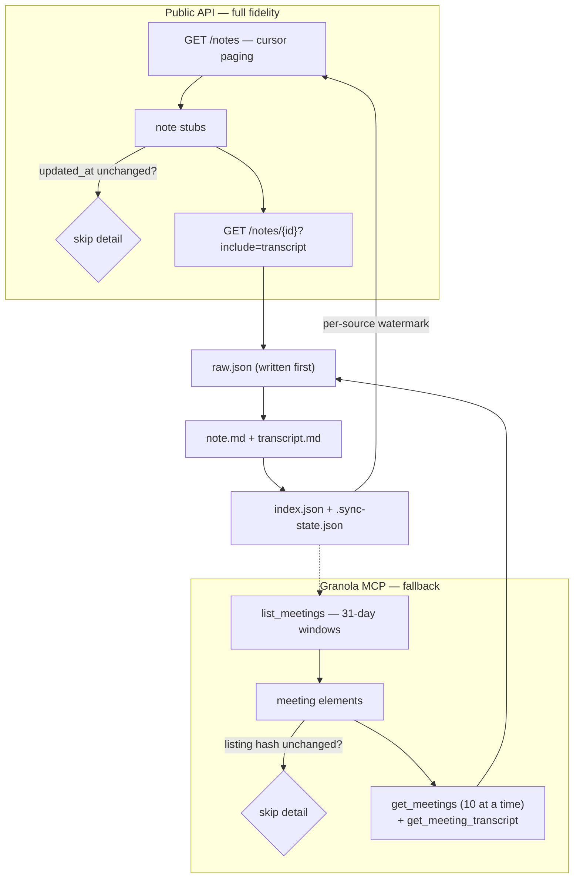

# granola-exporter

Keep a durable, local, incremental archive of your [Granola](https://granola.ai)
meetings — notes, AI summaries, diarized transcripts, attendees and folders — as
plain Markdown plus verbatim JSON.

## Why this exists

Granola is the only complete source of your meeting history, and it is not
guaranteed to hold it forever:

- **Transcript auto-deletion** can be enabled per user (1 day → 1 year) or
  imposed workspace-wide by an Enterprise admin. Granola documents deletion as
  *"permanent and irreversible."*
- **The local cache is not a backup.** Granola fetches transcripts on demand and
  purges older ones locally.
- **The local cache is also encrypted now.** `cache-v6.json` is a stale husk;
  live data lives in `cache-v6.json.enc`, `supabase.json.enc` and an encrypted
  `granola.db`, keyed by a `Granola Safe Storage` entry in the macOS keychain.
  Every exporter that reads `cache-v6.json` is broken.

This tool therefore pulls from Granola's **supported, documented interfaces** and
writes an archive that survives anything happening upstream.

## Two backends

API keys need a **Business or Enterprise** plan. The **MCP server works on every
plan, including free Basic** — so where a key cannot be obtained, the MCP is the
only supported path to the same data.

| | Public API | Granola MCP |
| --- | --- | --- |
| Plan required | Business / Enterprise | **All plans, incl. free** |
| Auth | `grn_` key in `.env` | Browser OAuth (`granola-export login`) |
| Timestamps | ISO 8601 `created_at` + `updated_at` | localised, minute-rounded; **no `updated_at`** |
| Incremental | `updated_after` + cursor paging | date windows + content hashing |
| Transcripts | diarized, timestamped utterances | flat text, speaker labels only |
| Folders | inline on every note | one extra listing per folder |
| Fidelity | full | **degraded** — marked as such |

`auto` (the default) uses the public API whenever a key is present. The MCP is a
**fallback, never an upgrade path away from the higher-fidelity source**: a note
already archived from the public API is never overwritten by MCP data, and if a
key arrives later the MCP copy is *promoted* in place rather than duplicated.

## How it works



`raw.json` is written **before** any rendering, so changing a Markdown template
never requires refetching. Re-running `sync` skips the per-note detail call
entirely when nothing has changed — a no-op public API sync costs three list
requests and zero detail fetches.

## Requirements

- macOS or Linux, Python ≥ 3.13, [`uv`](https://docs.astral.sh/uv/)
- Either a Granola **Business/Enterprise** plan (for an API key), **or** any
  plan at all (for the MCP backend)

## Setup

```bash
uv sync
cp .env.example .env
```

**With an API key** (Business/Enterprise) — create it in Granola under
**Settings → Connectors → Personal API Keys → Create new key**; it starts with
`grn_`. Paste it into `.env`.

**Without an API key** — authorise the MCP instead. This opens a browser once
and stores a token in `~/.local/state/granola-exporter/` (mode `0600`), outside
the archive so backing the archive up never carries credentials:

```bash
uv run granola-export login
```

The MCP grant is **separate from the desktop app's session** and will not log
you out of Granola — unlike the internal API, see below.

```bash
uv run granola-export doctor
```

## Usage

```bash
# First run: full backfill of every meeting
uv run granola-export sync

# Later runs: only new and changed meetings
uv run granola-export sync

# Per-note output
uv run granola-export sync -v

# Ignore the watermark and re-check everything
uv run granola-export sync --full

# Integrity check + reconcile against the API
uv run granola-export verify

# Force the MCP backend even when a key exists
uv run granola-export sync --source mcp

# Bound an MCP backfill
uv run granola-export sync --source mcp --since 2025-01-01
```

### Commands

| Command | Purpose |
| --- | --- |
| `doctor` | Validate credentials, backend reachability and archive location |
| `login` | Authorise the Granola MCP in a browser (`--no-browser`) |
| `logout` | Remove the stored MCP credentials |
| `sync` | Fetch new and changed meetings (`--full`, `-v`, `--source`, `--since`, `--window`, `--refresh-batch`) |
| `verify` | Check on-disk integrity, provenance and duplicates; reconcile upstream |

`doctor` and `sync` **never** open a browser: only `login` does. A scheduled
sync that silently blocked waiting for a browser would be a backup that had
stopped working without telling you.

## Archive layout

```
archive/
  2026/01/2026-01-27--quarterly-yoghurt-budget--not_1d3tmYTlCICgjy/
    note.md          # YAML frontmatter, summary, attendees, folders
    transcript.md    # speaker-labelled, timestamped, runs merged
    raw.json         # verbatim API payload
  index.json         # id -> path, dates, folders, content hash
  .sync-state.json   # updated_at watermark
```

`note.md` frontmatter is Obsidian-friendly:

```yaml
---
id: "not_1d3tmYTlCICgjy"
uuid: "d290f1ee-6c54-4b01-90e6-d701748f0851"
title: "Quarterly yoghurt budget: review"
created_at: "2026-01-27T15:30:00+00:00"
attendees:
  - "Oat Benson <oat@granola.ai>"
folders:
  - "Projects"
---
```

## Retention guarantees

The archive is **append-mostly by design**:

- A note that disappears upstream is **never deleted locally**. It is flagged
  `upstream_missing` in `index.json`, because surviving upstream deletion is the
  whole point.
- An archived transcript is never removed just because the API stops returning
  one.
- Renaming a meeting **moves** its directory rather than leaving a duplicate.

## Configuration

| Variable | Default | Purpose |
| --- | --- | --- |
| `GRANOLA_API_KEY` | — | Public API key (`grn_…`). Needed for the public API backend. |
| `GRANOLA_ARCHIVE_DIR` | `./archive` | Where the archive is written |
| `GRANOLA_SYNC_SOURCE` | `auto` | `auto`, `public-api` or `mcp` |
| `GRANOLA_MCP_URL` | `https://mcp.granola.ai/mcp` | MCP endpoint |
| `GRANOLA_MCP_TOKEN_FILE` | `$XDG_STATE_HOME/granola-exporter/mcp-oauth.json` | OAuth token cache |

`.env` is gitignored. `archive/` is gitignored too, since it holds private
meeting content — remove that line from `.gitignore` only if you deliberately
want it tracked.

## Known limitations

These were measured against a real 92-note archive, not assumed.

- **No audio, and no panels.** The public API returns exactly these fields:
  `id`, `object`, `title`, `web_url`, `owner`, `created_at`, `updated_at`,
  `calendar_event`, `attendees`, `folder_membership`, `space_membership`,
  `transcript`, `summary_text`, `summary_markdown`. There is no audio,
  recording, media, attachment or panel field on any note. Retrieving those
  would require the unsupported internal API — see below.
- **Only summarised notes are returned.** The API serves notes that have both a
  generated summary and a transcript; notes still processing return 404 and are
  counted as `skipped`.
- **Owner-scoped.** The API returns notes you own. A note shared into one of
  your folders by someone else — or a deleted note that leaves a dangling
  folder reference — can be counted by Granola's folder index while being
  unretrievable through any content-bearing endpoint.

  This is observable in practice. On the account this was built against, the
  Granola MCP's folder listing reported one more note in a folder than the
  public API's own `folder_id` filter returned for that same folder — and the
  public API's count matched the archive exactly. The extra note also returned
  `not_found` from the MCP's own `get_meetings`. No available API path returns
  its content, so no exporter can capture it.

  If `verify` reports a clean gap check, the archive is complete with respect
  to everything retrievable, even when Granola's own folder counts disagree.
- Rate limits are 25 requests / 5s burst and 5 requests/second sustained. The
  client paces itself with a token bucket and honours `Retry-After`.

### MCP mode: what you give up

All of this was measured against the live service, not assumed. If you have an
API key, use it — this backend exists for accounts that cannot get one.

- **No `updated_at`, and no cursor.** The MCP exposes neither an updated-since
  filter nor pagination, so change detection is rebuilt from what the listing
  does return: a hash of each `<meeting>` element stands in for the stub's
  `updated_at`. That catches retitles, date changes and participant changes.
- **Edits to older meetings lag.** An incremental run rescans a trailing window
  (31 days by default, `--window`) and re-reads the 30 least-recently-checked
  notes (`--refresh-batch`). A summary regenerated long after its meeting is
  picked up within a few runs, not immediately. `sync --full` catches it now.
- **Completeness is not provable.** With no pagination there is no way to know a
  listing was not truncated. Windows returning 50+ results are bisected and
  rescanned; a single day still at the cap is *reported* as possibly incomplete
  rather than silently trusted.
- **Transcripts lose their structure.** The MCP returns one flat string with
  inline `Me:`/`Them:`/`Name:` labels and no timing at all. It is split back
  into speaker turns heuristically, and `transcript.md` carries
  `degraded: true` and `timestamps: false`. Compare:

  ```
  public API   **[04:12] Oat Benson**
  MCP          **Them**
  ```
- **Dates are localised and minute-rounded.** The MCP reports a meeting's
  *scheduled start in local time* (`Jul 28, 2026 8:00 PM CDT`) where the public
  API reports `created_at` in UTC. Notes are filed under the resolved UTC date
  so both backends agree, and the original string is preserved verbatim in
  frontmatter as `date_text`. An unrecognised timezone abbreviation leaves the
  note **undated** rather than guessing — a visibly undated note is a better
  failure than a confidently wrong one.
- **No owner, calendar event, or `web_url`.** `web_url` is synthesised from the
  meeting UUID, which is safe because the id equivalence below is verified.
- **Folder membership costs extra.** Neither `list_meetings` nor `get_meetings`
  returns it, so it takes one listing per folder. Only folder *names* cross the
  boundary: MCP folder ids are UUIDs in a different namespace from `fol_*`.
- **Responses are prose, not a contract.** They are shaped for a language model,
  wrapped in a prompt-injection preamble, and can be reworded without notice.
  The parser fails **loudly** on drift rather than returning an empty window —
  see [SECURITY.md](SECURITY.md).
- **Free plans are further limited.** Basic caps history at 30 days and does not
  serve raw transcripts at all.
- **Transcripts are aggressively rate limited.** Measured live: `get_meeting_transcript`
  was still rejected at 20-second spacing, far below the ~100 req/min the docs
  quote for the tools overall. The client backs off (5s → 15s → 30s → 60s) and
  retries, but a large backfill will not fetch every transcript in one pass.
  Notes are archived **without** a transcript rather than being skipped, the
  count is reported as a warning, and **re-running `sync` retries exactly those
  notes** — an archived transcript is never refetched, so re-runs are cheap and
  converge. Budget several passes for a first MCP backfill.

### How the two backends join up

The MCP identifies meetings by UUID; the public API uses opaque `not_*` ids. The
UUID embedded in the public API's `web_url`
(`https://notes.granola.ai/d/<uuid>`) **is** the MCP's `meeting_id` — verified
against real meetings — and `index.json` has always recorded it. That is what
makes never-downgrade and promotion possible:

- A meeting already archived from the public API is skipped by MCP syncs —
  verified against a real 92-note archive: an MCP sync over a window containing
  six already-archived meetings reported `0 new, 0 updated, 6 unchanged` and
  issued **zero** detail fetches, leaving all 276 files byte-identical.
  Entries written before provenance tracking existed carry no `source` field
  and are correctly treated as public-API notes.
- When a key arrives, `sync` **adopts** the MCP entry: the directory is moved,
  the `not_*` key replaces the `mcp_*` one, and no duplicate is left behind.
- `verify` reports any UUID appearing under two keys, which should always be
  zero.

### On the internal API

The desktop app's internal API (`api.granola.ai`) exposes panels and rich
content, but it uses **WorkOS refresh-token rotation where refresh tokens are
single-use**. Any tool that refreshes that token invalidates the desktop app's
copy and **logs you out of Granola**. If enrichment is added here, it must read
the existing access token and never call the refresh endpoint.

## Security

The archive can contain highly sensitive meeting content, so:

- Archive files are written `0600` and directories `0700` — owner-only, rather
  than inheriting a typically world-readable umask. Set `chmod 600 .env` too;
  it holds a live API key.
- Note ids are validated before they are used to build filesystem paths or
  request URLs — `^not_[a-zA-Z0-9]{14}$` for the public API, and a stricter
  `^mcp_` + canonical lowercase UUID for MCP notes. Every archive path is then
  verified to resolve inside the archive root. A malicious API response cannot
  write outside the archive.
- **Widening the path validator did not widen the URL validator.** `mcp_*` keys
  can become directories but are still refused by `public_api.get_note` before
  any request is issued; there is a test asserting exactly that.
- MCP responses are parsed **without an XML parser**, so entity expansion and
  XXE are out of the threat model by construction rather than by configuring a
  parser correctly.
- The MCP OAuth token is stored outside the archive at
  `$XDG_STATE_HOME/granola-exporter/mcp-oauth.json`, mode `0600`, keyed by
  endpoint. `granola-export logout` removes it. The OAuth redirect listener
  binds `127.0.0.1` only, serves one request, and never reflects query
  parameters back into the page.
- `index.json` is treated as untrusted input; entries resolving outside the
  archive root are refused.
- Neither `.env` nor `archive/` is ever committed.

Dependencies are pinned in `uv.lock` and scanned against the OSV database by CI
on every push and pull request, plus weekly. See [SECURITY.md](SECURITY.md) to
report a vulnerability.

## Development

```bash
uv run pytest
```

Tests run fully offline — no API key, no network, no browser and no MCP server.
The public API is driven through `httpx.MockTransport`; the MCP backend through
a fake implementing `MCPProtocol`, which is why `sync_*` takes an already-built
client rather than constructing one.

`tests/test_security.py` holds regression tests for path containment, id
validation and file permissions. `tests/test_mcp_parse.py` is the highest-value
file in the suite: the MCP returns prose rather than a versioned contract, so
that is where drift has to surface.

## License

Source-available under the [PolyForm Noncommercial License 1.0.0](https://polyformproject.org/licenses/noncommercial/1.0.0/).

You may use, modify and share `granola-exporter` for any **noncommercial**
purpose — personal use, research, education, and nonprofit, public and
government use are all covered. **Any commercial use requires a separate
license** from the copyright holder.

This is *source-available*, not open source: it restricts commercial use.
Copyright © 2026 Jade Naaman. For a commercial license, contact the copyright
holder. See [LICENSE](LICENSE.md) for full terms.
