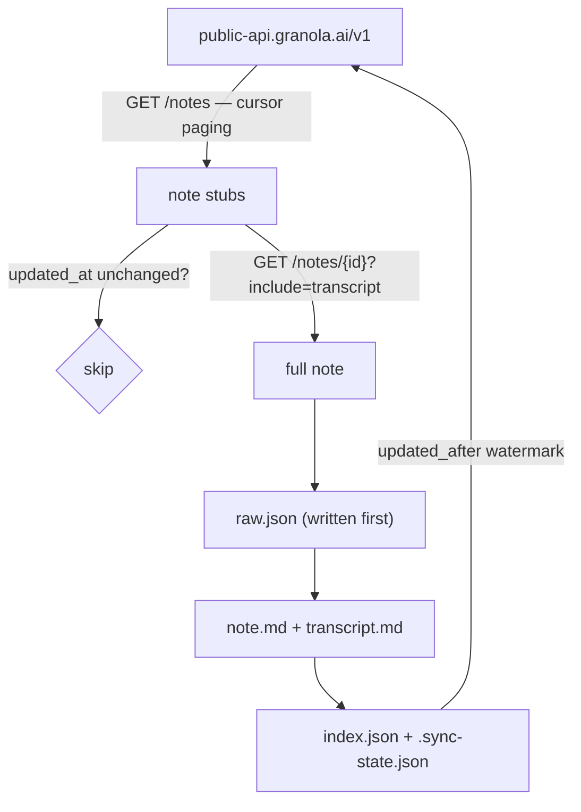

# granola-exporter

Keep a durable, local, incremental archive of your [Granola](https://granola.ai)
meetings — notes, AI summaries, diarized transcripts, attendees and folders — as
plain Markdown plus verbatim JSON.

## Why this exists

Granola is the only complete source of your meeting history, and it is not
guaranteed to hold it forever:

- **Transcript auto-deletion** can be enabled per user (1 day → 1 year) or
  imposed workspace-wide by an Enterprise admin. Granola documents deletion as
  *"permanent and irreversible."*
- **The local cache is not a backup.** Granola fetches transcripts on demand and
  purges older ones locally.
- **The local cache is also encrypted now.** `cache-v6.json` is a stale husk;
  live data lives in `cache-v6.json.enc`, `supabase.json.enc` and an encrypted
  `granola.db`, keyed by a `Granola Safe Storage` entry in the macOS keychain.
  Every exporter that reads `cache-v6.json` is broken.

This tool therefore pulls from the **official, supported public API** and writes
an archive that survives anything happening upstream.

## How it works



`raw.json` is written **before** any rendering, so changing a Markdown template
never requires refetching. Re-running `sync` skips the per-note detail call
entirely when a stub's `updated_at` matches the index — a no-op sync costs three
list requests.

## Requirements

- macOS or Linux, Python ≥ 3.13, [`uv`](https://docs.astral.sh/uv/)
- A Granola **Business or Enterprise** plan (required to create API keys)

## Setup

```bash
uv sync
cp .env.example .env
# then edit .env and paste your key
```

Create the key in Granola: **Settings → Connectors → Personal API Keys → Create new key**. It starts with
`grn_`.

```bash
uv run granola-export doctor
```

## Usage

```bash
# First run: full backfill of every meeting
uv run granola-export sync

# Later runs: only new and changed meetings
uv run granola-export sync

# Per-note output
uv run granola-export sync -v

# Ignore the watermark and re-check everything
uv run granola-export sync --full

# Integrity check + reconcile against the API
uv run granola-export verify
```

### Commands

| Command | Purpose |
| --- | --- |
| `doctor` | Validate the key, API reachability and archive location |
| `sync` | Fetch new and changed meetings (`--full`, `-v`) |
| `verify` | Check on-disk integrity and report any un-archived upstream notes |

## Archive layout

```
archive/
  2026/01/2026-01-27--quarterly-yoghurt-budget--not_1d3tmYTlCICgjy/
    note.md          # YAML frontmatter, summary, attendees, folders
    transcript.md    # speaker-labelled, timestamped, runs merged
    raw.json         # verbatim API payload
  index.json         # id -> path, dates, folders, content hash
  .sync-state.json   # updated_at watermark
```

`note.md` frontmatter is Obsidian-friendly:

```yaml
---
id: "not_1d3tmYTlCICgjy"
uuid: "d290f1ee-6c54-4b01-90e6-d701748f0851"
title: "Quarterly yoghurt budget: review"
created_at: "2026-01-27T15:30:00+00:00"
attendees:
  - "Oat Benson <oat@granola.ai>"
folders:
  - "Projects"
---
```

## Retention guarantees

The archive is **append-mostly by design**:

- A note that disappears upstream is **never deleted locally**. It is flagged
  `upstream_missing` in `index.json`, because surviving upstream deletion is the
  whole point.
- An archived transcript is never removed just because the API stops returning
  one.
- Renaming a meeting **moves** its directory rather than leaving a duplicate.

## Configuration

| Variable | Default | Purpose |
| --- | --- | --- |
| `GRANOLA_API_KEY` | — | Public API key (`grn_…`). Required. |
| `GRANOLA_ARCHIVE_DIR` | `./archive` | Where the archive is written |

`.env` is gitignored. `archive/` is gitignored too, since it holds private
meeting content — remove that line from `.gitignore` only if you deliberately
want it tracked.

## Known limitations

These were measured against a real 89-note archive, not assumed.

- **No audio, and no panels.** The public API returns exactly these fields:
  `id`, `object`, `title`, `web_url`, `owner`, `created_at`, `updated_at`,
  `calendar_event`, `attendees`, `folder_membership`, `space_membership`,
  `transcript`, `summary_text`, `summary_markdown`. There is no audio,
  recording, media, attachment or panel field on any note. Retrieving those
  would require the unsupported internal API — see below.
- **Only summarised notes are returned.** The API serves notes that have both a
  generated summary and a transcript; notes still processing return 404 and are
  counted as `skipped`.
- **Owner-scoped.** The API returns notes you own. A note shared into one of
  your folders by someone else — or a deleted note that leaves a dangling
  folder reference — can be counted by Granola's folder index while being
  unretrievable through any content-bearing endpoint.

  This is observable in practice. On the account this was built against, the
  Granola MCP's folder listing reported one more note in a folder than the
  public API's own `folder_id` filter returned for that same folder — and the
  public API's count matched the archive exactly. The extra note also returned
  `not_found` from the MCP's own `get_meetings`. No available API path returns
  its content, so no exporter can capture it.

  If `verify` reports a clean gap check, the archive is complete with respect
  to everything retrievable, even when Granola's own folder counts disagree.
- Rate limits are 25 requests / 5s burst and 5 requests/second sustained. The
  client paces itself with a token bucket and honours `Retry-After`.

### On the internal API

The desktop app's internal API (`api.granola.ai`) exposes panels and rich
content, but it uses **WorkOS refresh-token rotation where refresh tokens are
single-use**. Any tool that refreshes that token invalidates the desktop app's
copy and **logs you out of Granola**. If enrichment is added here, it must read
the existing access token and never call the refresh endpoint.

## Development

```bash
uv run pytest
```

Tests run fully offline against recorded fixtures using `httpx.MockTransport` —
no API key and no network required.

## License

Source-available under the [PolyForm Noncommercial License 1.0.0](https://polyformproject.org/licenses/noncommercial/1.0.0/).

You may use, modify and share `granola-exporter` for any **noncommercial**
purpose — personal use, research, education, and nonprofit, public and
government use are all covered. **Any commercial use requires a separate
license** from the copyright holder.

This is *source-available*, not open source: it restricts commercial use.
Copyright © 2026 Jade Naaman. For a commercial license, contact the copyright
holder. See [LICENSE](LICENSE.md) for full terms.
